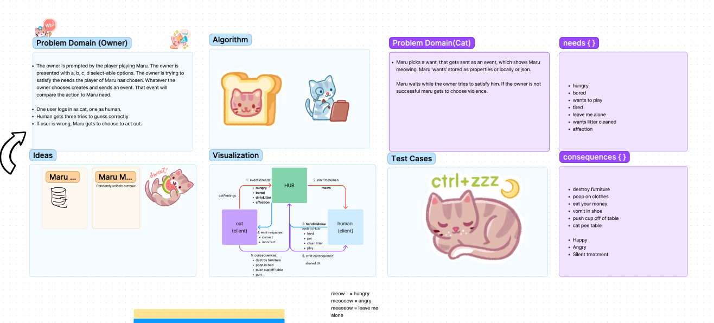

# LAB - Class 14

## Project: Event Driven Applications

For this project, we set out to create a real-time application in the form of a game in which users can etiher play as Maru or as a human.
We set up our Event Server to listen to events from each client and respond to them accordingly.
Our goal was to send broadcast events from the Maru client in the form of needs he has each corresponding to a cat event name. The Hub then would broadcast those events to the human client who then has to send back an event by choosing one of the human event names corresponding to what they think Maru might need.
We also wanted to create events in the form of consequences that Maru would broadcast based on whether or not human made the correct choice.

### Authors:

- Chris
- Ethan
- Ezgi
- Gaz

#### How to initialize/run your application (where applicable)

- `npm run hub`
- `npm run maru`
- `npm run human`
- `npm start`

<!-- #### How to use your library (where applicable) -->

#### Whiteboard Process

